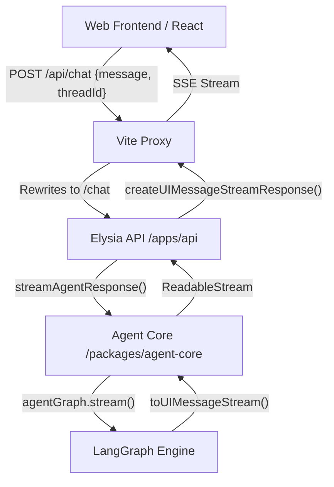

# Full-Stack AI Agent Architecture

This document describes the high-level architecture of the AI Agent solution, focusing on how the frontend, backend, and core agent logic interact using the Vercel AI SDK Data Stream Protocol.

## Technology Stack

- **Frontend**: React (Vite), Tailwind CSS v4, AI SDK 
- **Backend API**: Elysia (Bun)
- **Agent Core**: LangGraph (LangChain), @ai-sdk/langchain
- **Communication**: SSE (Server-Sent Events) via [AI SDK Data Stream Protocol](https://sdk.vercel.ai/docs/ai-sdk-ui/stream-protocol)

---

## High-Level Diagram

---

## Key Components

### 1. Web Frontend (`apps/web`)
- **State Management**: Uses the AI SDK's `useChat` hook.
- **Custom Request Format**: We use `prepareSendMessagesRequest` in the `useAgentChat` hook to transform the standard messages array into a single `message` string and a `threadId`, matching the backend's expected schema.
- **Rendering**: `MessageBlock.tsx` handles different stream parts:
    - `text`: Standard response.
    - `reasoning`: Thinking/Internal monologue.
    - `dynamic-tool`: Real-time tool execution status (calling vs results).

### 2. Backend API (`apps/api`)
- **Endpoint**: `POST /chat`.
- **Function**: Acts as a thin wrapper over the Agent Core. It receives the request, delegates execution, and returns a streaming response using `createUIMessageStreamResponse`.

### 3. Agent Core (`packages/agent-core`)
- **Engine**: LangGraph manages the agentic workflow (nodes for "agent" and "tools").
- **Protocol Conversion**: Uses `@ai-sdk/langchain`'s `toUIMessageStream` to convert LangGraph's internal event tokens into the [Data Stream Protocol](https://sdk.vercel.ai/docs/ai-sdk-ui/stream-protocol).
- **Tooling**: Logic for file operations and other agent capabilities.

---

## Non-Obvious Implementation Details

### Thread Management
The `threadId` is currently generated in the **Frontend** (`useAgentChat.ts`) using `crypto.randomUUID()`. This allows the frontend to maintain session continuity during a single session and allows the backend to utilize LangGraph's checkpointer mechanism for state persistence.

### Vite Proxy Configuration
To avoid CORS issues and simplify development, Vite is configured to proxy `/api` requests to `localhost:3000`. 
- **Path Rewrite**: Vite rewrites `/api/chat` to `/chat` before it hits the Elysia server, as the backend routes are currently not prefixed with `/api`.

### Streaming Part Types
The agent streams multiple types of data:
- `text`: Standard content
- `reasoning`: Thinking process
- `dynamic-tool`: Tool call/result updates

For a full list of part types, see the [official specification](https://sdk.vercel.ai/docs/ai-sdk-ui/stream-protocol#data-stream-protocol).
